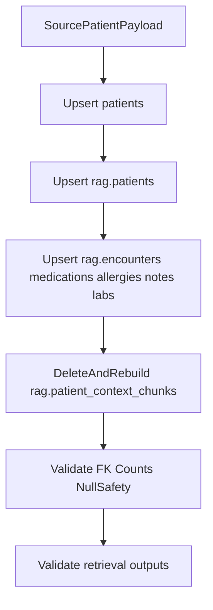

# Patient Data Ingestion Schema Contract

This contract defines how to ingest a new patient with large medical history into QueueIQ's centralized PostgreSQL storage used by both auth/session APIs and RAG retrieval.

## Scope

- In scope: patient account mapping, RAG clinical history mapping, retrieval chunk generation, idempotent load order, and validation checks.
- Out of scope: clinic knowledge ingestion (`rag.clinic_*`) and chat trace ingestion (`rag.chat_turns`, `rag.retrieval_traces`, `rag.llm_runs`), which are runtime-generated.

## Canonical Identity Contract

- Every inbound patient must resolve to a single canonical `patient_id`.
- The same `patient_id` must be used in:
  - `patients` (public account table)
  - `rag.patients`
  - all patient-scoped `rag.*` history tables
- Source systems should provide stable external IDs; if not available, generate deterministic IDs and persist mapping in the ingestion system.

## Source Payload Contract (Canonical Input)

Use a canonical payload shape in your ETL/job layer before SQL writes:

```json
{
  "patient": {
    "patient_id": "pat_123",
    "full_name": "Jane Doe",
    "email": "jane.doe@example.com",
    "email_verified": true,
    "role": "patient",
    "clinic_id": null,
    "date_of_birth": "1985-06-21",
    "sex": "F",
    "medical_profile": {
      "blood_group": "O+",
      "allergies": "Penicillin",
      "medications": "Metformin 500mg BID",
      "chronic_conditions": "Type 2 Diabetes"
    }
  },
  "encounters": [],
  "medications": [],
  "allergies": [],
  "clinical_notes": [],
  "lab_summaries": []
}
```

## Field-by-Field Target Mapping

### 1) Public account mapping (`patients`)

Required target columns:

- `patient_id` <- `patient.patient_id`
- `full_name` <- `patient.full_name` (fallback to `patient_id` only if source missing)
- `email` <- normalized lowercase `patient.email`
- `role` <- `patient.role` (default `patient`)
- `created_at`, `updated_at` <- ETL load timestamp (UTC ISO8601)

Optional target columns:

- `email_verified` <- `patient.email_verified` (default `false`)
- `is_admin` <- derived (`true` when role is `manager`)
- `clinic_id` <- `patient.clinic_id` (normally null for role `patient`)
- `medical_profile_json` <- serialized `patient.medical_profile`
- `professional_profile_json` <- null for role `patient`
- `password_hash`, `last_login_at` <- managed by auth flow, not ingestion (unless explicitly required by identity migration policy)

### 2) RAG core patient mapping (`rag.patients`)

Required target columns:

- `patient_id` <- `patient.patient_id`
- `full_name` <- `patient.full_name`

Optional target columns:

- `date_of_birth` <- `patient.date_of_birth` (DATE)
- `sex` <- `patient.sex`
- `created_at` is DB-defaulted (`NOW()`)

### 3) Clinical history mapping (`rag.*`)

`rag.encounters`:

- `encounter_id` <- source encounter ID
- `patient_id` <- canonical `patient_id`
- `clinic_id` <- source clinic ID
- `encounter_type` <- normalized source code/text
- `encounter_date` <- UTC timestamp
- `summary` <- concise encounter summary

`rag.medications`:

- `medication_id` <- source medication ID
- `patient_id` <- canonical `patient_id`
- `medication_name`, `dosage`, `frequency`, `start_date`, `end_date`, `active`

`rag.allergies`:

- `allergy_id` <- source allergy ID
- `patient_id` <- canonical `patient_id`
- `allergen`, `reaction`, `severity`, `active`

`rag.clinical_notes`:

- `note_id` <- source note ID
- `patient_id` <- canonical `patient_id`
- `encounter_id` <- source encounter reference (nullable)
- `note_type` <- normalized note category
- `content` <- note text
- `created_at` <- source timestamp or DB default

`rag.lab_summaries`:

- `lab_summary_id` <- source lab summary ID
- `patient_id` <- canonical `patient_id`
- `test_name`, `summary`, `test_date`

### 4) Retrieval chunk mapping (`rag.patient_context_chunks`)

Each chunk row must map back to one source artifact:

- `chunk_id` <- deterministic chunk ID (example: hash of `patient_id|source_type|source_id|chunk_order`)
- `patient_id` <- canonical `patient_id`
- `source_type` <- one of `encounter`, `medication`, `allergy`, `clinical_note`, `lab_summary`
- `source_id` <- row ID in the source table
- `chunk_text` <- retrieval text snippet
- `chunk_order` <- stable positive integer per source item
- vector storage:
  - if pgvector enabled: `embedding`
  - else: `embedding_text` fallback

## Idempotent Load Sequence



Execution rules:

1. Upsert `patients` first.
2. Upsert `rag.patients` second.
3. Upsert structured history with deterministic IDs.
4. Rebuild chunks for that patient only:
   - delete existing `rag.patient_context_chunks` for `patient_id`
   - generate new chunks from current structured rows
5. Commit in bounded batches; retry transient failures.

## Conflict and FK Policy

- Use `ON CONFLICT (id) DO UPDATE` for all domain entities.
- Never regenerate entity IDs on reruns.
- Keep parent-before-child order:
  - `patients` -> `rag.patients` -> child `rag.*` rows
- For `rag.clinical_notes.encounter_id`, allow null if source has no encounter linkage.
- If child rows reference missing parent IDs, reject row and log to dead-letter/report table in ETL layer.

## Chunking Policy for Large Histories

- Generate chunks from normalized summaries, not raw unbounded documents.
- Suggested limits:
  - target 300-900 chars per chunk
  - hard cap 1,500 chars (split if exceeded)
- Preserve clinical meaning (do not split medication name/dose/frequency across chunks).
- Keep at least one chunk per structured source row.

## Retrieval Compatibility Checks

The retriever expects both structured and chunked data paths:

- Lexical path pulls from:
  - `rag.encounters`
  - `rag.medications` (`active = TRUE`)
  - `rag.allergies` (`active = TRUE`)
  - `rag.clinical_notes`
  - `rag.lab_summaries`
- Vector path pulls from:
  - `rag.patient_context_chunks`

Post-ingestion checks for each patient:

1. Row-presence checks in all expected `rag.*` tables.
2. Active flags are set correctly for medications/allergies.
3. Chunk count >= structured-source count baseline.
4. Retrieval sample query returns mixed relevant `source_type` rows.
5. Rerun same payload and verify no duplicate primary keys.

## Acceptance Criteria

- Patient exists in both `patients` and `rag.patients` with the same `patient_id`.
- Structured history rows are queryable in all five patient history tables.
- `rag.patient_context_chunks` is populated and linked to valid `source_id` values.
- Retrieval returns relevant snippets without degrading to empty/weak context.
- Re-ingestion is idempotent and only updates changed fields.

## Implementation Notes

- Keep ETL logging PHI-safe: log counts and IDs, not full note bodies.
- Normalize times to UTC before write.
- For backfills, process per patient in transactions sized to avoid long locks.
- Run ingestion QA per batch and emit a machine-readable report for audit.
